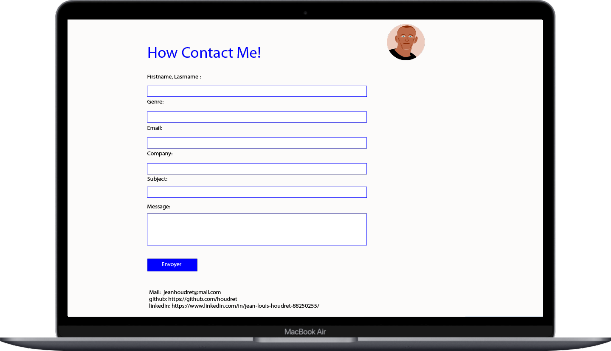

# Personal-contact-page
Lien vers Heruko : "https://git.heroku.com/personal-contact-page1.git"

# Mock-up creation :
|||

# création de la page index.php du formulaire
création en HTML d'un Form avec champ à remplir obligatoirement avec en premier lieu une validation grâce à Bootstrap, puis en PHP avec les nouvelles fonction intégrées : "FILTER_SANITIZE_STRING" et "FILTER_VALIDATE_EMAIL";

# création de la base de données
création d'une table de donnnée avec mySQL sous xampp , utilisation de PDO 
